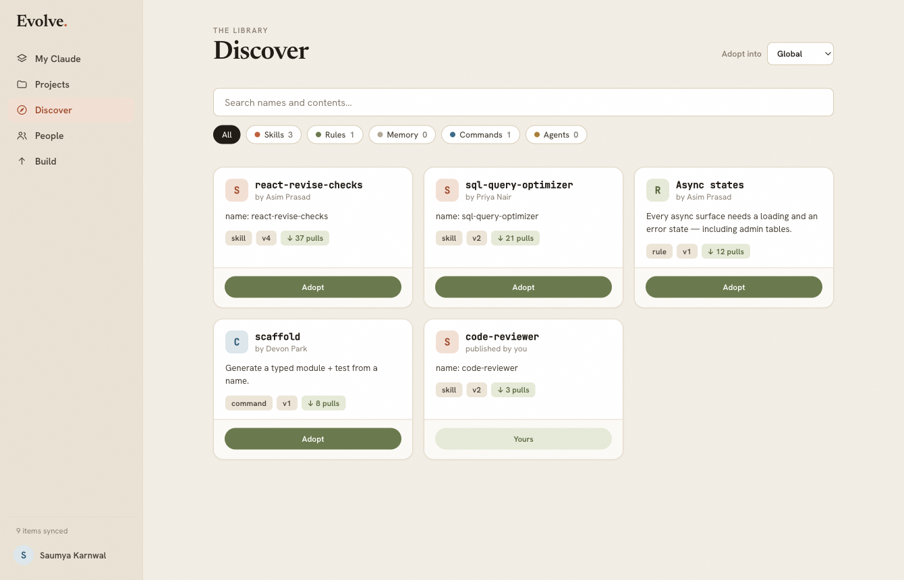
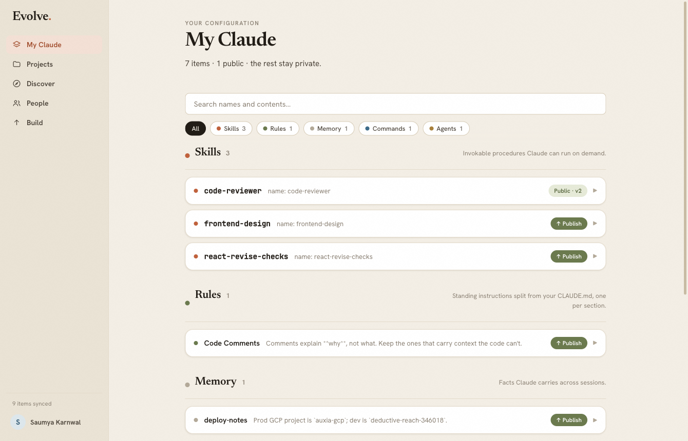

<div align="center">

# ✦ Evolve

### Your Claude Code setup, shared.

**The home for your Claude Code configuration — and a library of everyone else's.**
<br/>Discover skills, rules, and agents that actually work. Adopt them in one click. Share your own.

<br/>

[](https://github.com/SaumyaKarnwal/evolve/releases/latest)
&nbsp;

&nbsp;
[](https://github.com/SaumyaKarnwal/evolve/releases/latest)

<br/>



</div>

---

## The problem

You've spent hours tuning your Claude Code setup — the right skills, the rules that keep it on track,
the agents that do real work. All of it sits invisible in a `~/.claude` folder on one laptop.

Your teammates? Rebuilding the same things from scratch. Nobody can see what anyone else made.

> **Evolve makes your Claude setup visible, shareable, and collective** — no copy-pasting dotfiles, no
> "can you send me that prompt again."

## What you can do

|  |  |
|---|---|
| 🏠 **See it all** | Every skill, rule, memory, command, and agent across your projects — in one clean place instead of hidden folders. |
| 🔭 **Discover** | Browse a living library of configs real people use, and **adopt** any of them into your setup with one click. |
| 🚀 **Share** | Publish your best work — publicly or just to your team — so others can pick it up instantly. |
| 🔄 **Stay current** | When something you adopted improves upstream, Evolve flags it and merges the update smartly — using *your own* Claude. |
| 🔒 **Stay private** | Everything lives on your machine. Nothing leaves it unless you choose to publish. |

<div align="center">
<br/>

<br/>
<sub><i>Your entire <code>~/.claude</code> — skills, rules, memories, commands, agents — in one view.</i></sub>
</div>

## How it works

```
   1. Install            2. It reads your          3. Discover, adopt,
   & open Evolve   →     ~/.claude instantly   →   and share — one click
```

No config files. No terminal. Just open it.

## Download

<div align="center">

### [⬇️ &nbsp; Get Evolve for your platform](https://github.com/SaumyaKarnwal/evolve/releases/latest)

</div>

| Platform | File | Install |
|---|---|---|
| **macOS** | `.dmg` | Open it, drag Evolve to Applications. First launch: right-click → **Open**. |
| **Windows** | `.msi` | Run it. If SmartScreen appears: **More info → Run anyway**. |
| **Linux** | `.AppImage` / `.deb` | `chmod +x` the AppImage and run, or `sudo dpkg -i` the deb. |

> The first-launch prompt appears because Evolve is a new, independently-built app — it's safe, and you
> only do it once.

## Always up to date

Evolve updates itself. It checks for new versions on launch and installs them quietly in the background —
you're always on the latest, and you never re-download.

<br/>

<div align="center">

**[⬇️ Download Evolve →](https://github.com/SaumyaKarnwal/evolve/releases/latest)**

<sub>Built with ❤️ for the Claude Code community.</sub>

</div>

---

<details>
<summary><b>Build from source (for developers)</b></summary>

<br/>

Evolve is a [Tauri](https://tauri.app) app — a React + Vite frontend (`web/`) in a Rust shell
(`src-tauri/`). You'll need [Rust](https://rustup.rs), Node ≥ 20, and the
[Tauri prerequisites](https://tauri.app/start/prerequisites/).

```bash
cd web && npm install && cd ..
cargo tauri dev      # run in dev (auto-starts the frontend)
cargo tauri build    # build installers for your OS
```

> These commands are **only** for compiling the app yourself. Everyone else just downloads the installer
> above and double-clicks — no terminal involved.

**Releasing** is automated: bump the version in `src-tauri/tauri.conf.json` and `src-tauri/Cargo.toml`,
then push a tag (`git tag v0.2.0 && git push origin main --tags`). GitHub Actions builds and signs all
three platforms and publishes the release. A normal push never publishes anything.

</details>
