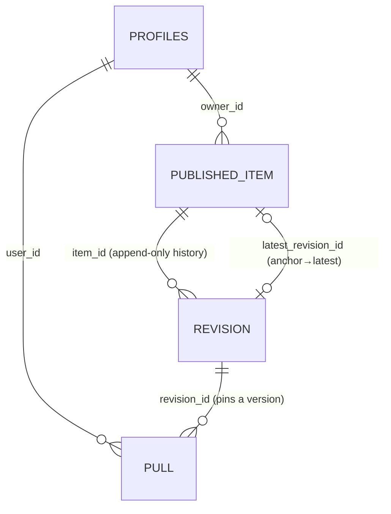

# Evolve — Technical Design Document (Consolidated)

> **Evolve** — sync, share & pull Claude Code setups (skills, rules, memories) between people.
> Local-first: your `~/.claude` config stays on your machine; only what you deliberately publish reaches
> a public registry. "GitHub for Claude setups."

This is the consolidated design. It merges the design-pipeline artifacts (`design/`), the user stories
(`docs/user-stories.md`), and the data model (`docs/schema.md`) into one read. The two centerpieces are
the **Decisions Register** (§7) and the **Trade-off Matrices** (§8).

---

## 1. Problem & vision

A Claude Code user accumulates configuration — skills, rules, memories — scattered across many projects
(`~/.claude/` globally + per-project dirs). There's no single view of "everything I've built," and no way
to share a useful skill or adopt a respected person's whole setup. Evolve makes a user's setup
**visible, shareable, and adoptable**, while keeping everything private by default.

## 2. Goals / non-goals

**Goals:** one-command inventory of your setup · deliberate publishing · pull/adopt others' setups ·
versioned, reproducible · private-by-default · cheap to run · no hard lock-in.
**Non-goals (now):** team ownership of items · a merge engine for prose configs · auto-syncing local
edits · being a backup for *private* files (that's git/Time Machine).

## 3. Phasing roadmap

| Phase | Scope | State |
|---|---|---|
| **1** | **Local sync** — scan `~/.claude`, parse, index in SQLite, `list` grouped | designed (this TDD) |
| 2 | Publish + registry (Supabase) + auth | designed as seams |
| 3 | Pull + similarity triage + install | designed as seams |
| 4 | Adopt-a-build + profiles + search | designed as seams |
| 5 | Updates, teams (audience), LLM-assisted blend/split | seams only |

Everything past Phase 1 is **designed as additive seams** in the schema (provenance table, `source_anchor`,
visibility enum, anchor+history) so later phases land without migrations-of-pain.

## 4. User journeys

The hero flow (Saumya shares; Asim adopts):

```
sync ──▶ list ──▶ [register] ──▶ publish ──▶ (Asim) browse ──▶ pull one ──▶ adopt build ──▶ "pulled 3×"
 P1      P1         P2            P2           P4               P3            P4              P4
```

Seven MVP stories (full detail in `docs/user-stories.md`): **US1 sync · US2 publish · US3 pull ·
US4 adopt · US5 improve(revision) · US6 update-available · US7 stay-private.**

## 5. Architecture

Single local CLI (`evolve`), structured around **one deep module that owns all `~/.claude` knowledge**
(the layout adapter) + a thin SQLite store. Registry (later phases) is Supabase.

```
evolve <cmd>
  ├─ sync ─▶ discoverProjects() + scan() ─▶ [Phase 1: drop-rebuild] ─▶ SQLite
  └─ list ─▶ query ─▶ render (Global / per-project / Unresolved)

   LAYOUT ADAPTER (D3): the ONLY module that knows ~/.claude paths
   — discoverProjects(), scan(); parsers: skill · rule · memory
```

The adapter isolates the **one structural risk** (Claude Code changing `~/.claude`'s layout) to a single
patchable module.

## 6. Data model (summary)

Two stores, one direction of truth: **disk → local index → registry.** Full DDL in `docs/schema.md`.

**Local (SQLite):** `item` (uniform, opaque body) · `provenance` (durable publish/pull binding) ·
`embedding` (content-addressed cache) · `project` (discovered scan sources).

**Registry (Supabase Postgres):** `profiles` (our id + broker link) · `published_item` (anchor) ·
`revision` (append-only history) · `pull` (social edge). RLS enforces visibility in the DB.



---

## 7. Decisions Register

Every non-obvious choice, why, and what it costs. `D*` = cross-phase design decisions; `PD*` = Phase-1
build decisions.

### Data model & local store
| # | Decision | Why | Cost |
|---|---|---|---|
| D1′ | Local DB is durable for identity/provenance, a mirror for content | Re-sync rebuilds content; provenance can't be re-derived from disk | DB not casually disposable; `relink` recovery path |
| D2 | Uniform `item`, `kind` is data, `body` opaque | New kinds are free; transport is uniform | No per-kind validation at core (lives in installer) |
| D3 | One layout adapter owns all `~/.claude` knowledge | Layout drift = one-file patch | — |
| D7 | Provenance in a separate table | Content mirror reconciles freely while links persist | — |
| D10 | Ids are identity, names are labels | Renames don't cascade; URLs resolve name→id | — |
| D11′ | Surrogate local id + reconcile + rename-detect | Honors id≠label; preserves provenance across edits | Heuristic rename detection (deferred to Phase 2) |
| — | `project_path` nullable FK (NULL = global), not (enum+path) | Contradiction unrepresentable; scope is binary | — |
| — | Embedding joined by `content_hash`, not id | Shared across identical bodies; survives id churn | — |

### Sharing & versioning
| # | Decision | Why | Cost |
|---|---|---|---|
| D5 | Anchor (`published_item`) + append-only `revision` | "What I pulled" stays byte-true forever | join complexity; keep old bodies (tiny) |
| D6 | Pull records revision + **disposition** | Powers "update available" + blend-warning | one column captured early |
| D8 | Adopt = loop over pull; **build = a query** | No Build entity needed in MVP | named/curated builds deferred |
| D13 | Re-publish is explicit, same gate | No silent public leaks | owner must remember (drift, D16) |
| D14 | Build reproducible via append-only revisions + pinned provenance | No build-snapshot entity | registry can't replay "build as of T" (nobody needs it) |
| D15 | `latest_revision_id` anchor pointer | Fast "latest"; clean anchor+history | one pointer write per publish |
| D16 | Cache `published_content_hash` locally | Offline drift detection | one provenance field |
| D18 | Extract-on-publish, install-as-file (never merge) | Embedded items become atomic at the boundary; no merge engine | pulled rules sit as separate files |
| D21 | Indexes/aggregates regenerated from source, never appended | Duplicates structurally impossible | recompute, not patch |
| D22 | Memory = fact file (atomic); MEMORY.md index section regenerated | Memory works without merge or dup | one bounded section-replace |
| D23 | Rules are individual items, atomic install, **batched** publish | Shareable via build, no merge, no dup | no per-rule publish UX |
| D24 | Local delete ≠ unpublish | Deleting a file can't break pullers | unpublish is a separate explicit act |
| D25 | DB-loss recovery is a designed flow | `sync` → auto-rebind by content hash → `relink` | — |

### Privacy & visibility
| # | Decision | Why | Cost |
|---|---|---|---|
| D4 | Privacy structural — **private = no registry row** | Can't leak what was never sent | no server-side ops on private items |
| D12 | `visibility` enum + fail-closed reads (RLS) | TEAM seam + structural fail-closed | constant column in MVP |
| — | Registry enums omit `PRIVATE` | A private row in the public registry is unrepresentable | — |

### Backend & auth
| # | Decision | Why | Cost |
|---|---|---|---|
| D26 | Identity ≠ credential — Supabase `auth.users`/`identities` | Multi-provider for free; broker is replaceable | — |
| D27 | Backend = **Supabase free tier** (Postgres+pgvector+Auth+Edge Fns) | One platform matches the whole design; $0 at scale; portable Postgres | 7-day idle pause on free tier |
| D28 | Store `email` in `profiles` as the **migration bridge** | Broker swap = re-link by email; accounts never lost | one column |
| D29 | `profiles` owns its `id` + a single `auth_user_id` link (Design B) | Data references our id → broker swap touches zero data rows | one extra RLS hop |

### Phase-1 build decisions
| # | Decision | Why | Cost |
|---|---|---|---|
| PD1 | **drop-and-rebuild** the item table each sync | No provenance to preserve yet — reconcile has no Phase-1 payoff | small rework when Phase 2 adds provenance |
| PD2 | CLAUDE.md as **one `rule` item** | Splitting is the riskiest parser; not needed for list-only | richer "12 rules" view deferred |
| PD3 | transcript-`cwd` → fallback decode → "Unresolved" + warning | Never fail silent | — |
| PD4 | **TypeScript / Node** | In-process embeddings later, shared types with web/registry, npx distribution | needs Node runtime |

---

## 8. Trade-off Matrices

The "design-it-twice" comparisons. ✅ = chosen.

### 8.1 Backend platform
| Option | Postgres+pgvector fit | Auth incl. | $ at MVP | Pause issue | Lock-in |
|---|---|---|---|---|---|
| ✅ **Supabase** | ✅ is Postgres+pgvector | ✅ | $0 | 7-day idle | low (portable PG) |
| Neon + Cloudflare Workers | ✅ + ✅ | ✗ (add separately) | $0 | none | low |
| Firebase | ✗ (Firestore NoSQL) | ✅ | $0 | none | medium |
| Self-host (VPS) | ✅ | ✗ build it | ~$0–5/mo | none | none, but you own ops |
*Chose Supabase: one platform matching the whole design; Neon+Workers is the no-pause fallback if needed.*

### 8.2 Auth approach
| Option | $ | Control | Security risk | Effort |
|---|---|---|---|---|
| Managed (Clerk/Auth0/**Supabase**) | $0→per-MAU | low | low (they own it) | lowest |
| ✅ **Supabase Auth** (managed, in-platform) | $0 | med | low | lowest |
| Self-host library (Auth.js/Passport) | $0 | high | low-ish | medium |
| Hand-roll OAuth | $0 | total | **high** | high |
*"Don't roll your own auth" = don't hand-roll the crypto. Supabase Auth gives multi-provider free.*

### 8.3 Identity ↔ broker linkage
| Option | RLS simplicity | Migration off broker | Consistency w/ D26 |
|---|---|---|---|
| A: `profiles.id` = auth uuid | ✅ trivial | ✗ remap all `owner_id` | partial |
| ✅ **B: own id + `auth_user_id` link** | one hop | ✅ re-point 1 column, zero data rows | full |
*Chose B: data references our id → broker swap touches no data; one extra RLS hop is worth it.*

### 8.4 Item ↔ project link
| Option | Illegal states | Referential integrity | Extensible to 3+ scopes |
|---|---|---|---|
| (enum `scope_type` + path) | ✗ can contradict | weak | ✅ |
| ✅ **nullable `project_path` FK** | ✅ unrepresentable | ✅ FK | ✗ (binary only) |
*Chose FK: scope is binary (global/project); contradiction-proof beats hypothetical 3rd scope.*

### 8.5 `rev_number` vs `id`
| | global `id` | per-item `rev_number` |
|---|---|---|
| Role | machine identity (FKs, pins) | human version label, ordering, "N behind" |
| Keep? | ✅ | ✅ — not redundant (identity vs label) |
*Both: FKs reference `id`; `rev_number` for display + the `UNIQUE(item,rev)` double-insert guard.*

### 8.6 Build model
| Option | MVP cost | Curated/named builds | Groups later |
|---|---|---|---|
| ✅ **Implicit (= public items), schema-ready** | smallest | additive later | additive |
| Explicit named builds now | more UI | now | additive |
| Plain `is_public` boolean | smallest | migrate later | migrate |
*Chose implicit-but-membership-modeled: no Build entity now, named/team builds drop in without migration.*

### 8.7 Embedded items (CLAUDE.md) handling
| Option | Share one rule | Merge engine | Frequent path |
|---|---|---|---|
| ✅ **Extract-on-publish, install-as-file** | ✅ | none | clean |
| Whole CLAUDE.md as one item | ✗ | none | clean but coarse |
| Skip CLAUDE.md | ✗ | none | — |
*Chose extract+install-as-file: granular sharing, zero merge engine. (Phase 1 lists CLAUDE.md whole; split lands with publish.)*

### 8.8 Phase-1 sync strategy
| Option | Complexity | Phase-1 payoff |
|---|---|---|
| ✅ **Drop-and-rebuild** | low | sufficient (no provenance yet) |
| Reconcile + stable ids + rename-detect | higher | none until provenance exists (Phase 2) |
*Chose drop-rebuild: YAGNI — reconcile earns its keep only once publish/provenance lands.*

### 8.9 LLM-assisted features (blend/split — later)
| Option | $ to us | Coverage | Dependency |
|---|---|---|---|
| ✅ **BYO `claude -p`** (user's subscription) | $0 | full | user's Claude Code (≈100% of audience) |
| Ollama (local OSS model) | $0 | good (weak on transcript-mining) | 4–5GB model |
| None / manual | $0 | manual | none — always the fallback |
*Chose: provider abstraction; `claude -p` tier-1, manual always works. LLM features are optional garnish.*

### 8.10 Local store technology
| Option | Transactions | Indexed queries | Fit |
|---|---|---|---|
| ✅ **SQLite** | ✅ | ✅ | single-user, file-based, perfect |
| JSON file | ✗ | ✗ | loses both |
| Server DB | ✅ | ✅ | absurd for one laptop |

---

## 9. Risks & mitigations

| Risk | Mitigation |
|---|---|
| `~/.claude` layout drift (the structural risk) | All path knowledge behind the layout adapter (D3) — one-file patch |
| CLAUDE.md parsing heuristics | Phase 1 treats it as one item (PD2); splitter built when publish needs it |
| Malformed config files | Skip-with-warning contract; never abort a sync |
| Supabase free-tier idle pause | Real traffic prevents it; optional cron keep-alive; Pro ($25/mo) removes it |
| Auth-broker lock-in | D28/D29 — own the id + email bridge; migration = re-link by email, zero data rows moved |
| Accidental publish of secrets | Secret/PII scan gate at publish (Phase 2) |

## 10. Open questions

- Phase-2 "pulled N times" under RLS — `SECURITY DEFINER` view vs denormalized counter (D9).
- Team **ownership** (vs audience) — deferred; the one genuinely invasive future change.
- Whether Phase 1 ships any UI beyond the CLI (default: CLI-only; web is a later wrapper).

## 11. Deep-dive references

- **`docs/schema.md`** — full DDL (local + registry), Mermaid ER diagrams, RLS policies, D1–D29.
- **`docs/user-stories.md`** — the 7 MVP user stories with flows, edge cases, MVP cuts.

*(The per-feature design-pipeline trail — PRD, architecture review, tech-lead review, implementation
plan, code review — is ephemeral scaffolding kept in a local workshop, not committed here. Its durable
conclusions live in this TDD's Decisions Register and Trade-off Matrices.)*
