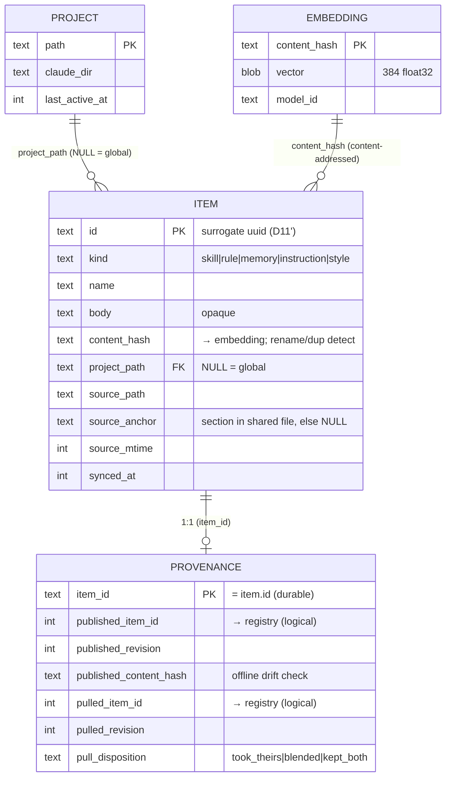
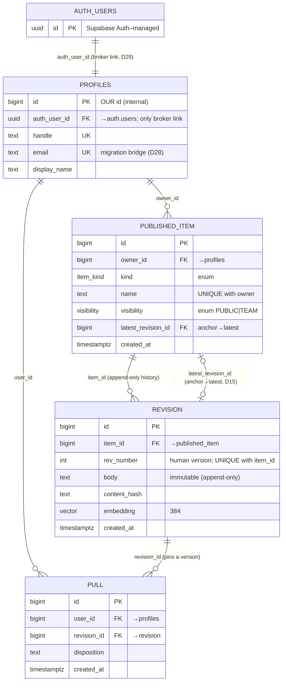

# Evolve — Data Schema

> Two stores, one direction of truth: **disk → local index → registry.**
> The local DB mirrors `~/.claude` for content and is the durable home of identity + provenance.
> The registry holds only the public world (private items have *no* registry row).

How to read this doc: every table is annotated with *why it exists* and every non-obvious column
traces to a decision (Dxx) or an access pattern. Indexes are derived from the queries the user
stories run, not guessed.

---

## Part 1 — Local store (SQLite at `~/.evolve/evolve.db`)

The local DB has three durability tiers. A reader should be able to tell, per table, what
`evolve sync` is allowed to touch:

| Tier | Tables | Rebuildable from disk? |
|------|--------|------------------------|
| **Content mirror** | `item` | ✅ reconciled each sync |
| **Identity + provenance** | `provenance` | ❌ durable; loss recoverable only via `evolve relink` |
| **Cache** | `embedding` | ✅ disposable, keyed by content |
| **Discovery** | `project` | ✅ rediscovered each sync |

### `item` — content mirror of one thing in `~/.claude`

```sql
CREATE TABLE item (
  id            TEXT PRIMARY KEY,        -- surrogate uuid, minted once, kept across syncs (D11')
                                         --   NOT derived from name — names are labels (D10)
  kind          TEXT NOT NULL
                  CHECK (kind IN ('skill','rule','memory','instruction','style')),
                                         -- enum via CHECK; SQLite has no enum type. data, not structure (D2)
  name          TEXT NOT NULL,           -- label; reconcile key with project_path
  body          TEXT NOT NULL,           -- opaque payload; the system never parses it (D2)
  content_hash  TEXT NOT NULL,           -- re-sync diff, dup detection, rename detection (D11');
                                         --   ALSO the join key to `embedding` (content-addressed, not by id)

  project_path  TEXT REFERENCES project(path),  -- NULL = global; set = that project. The item↔project link.
                                         --   nullable FK beats an (enum + path) pair: a contradiction is
                                         --   unrepresentable, no consistency CHECK needed (scope is binary)

  -- where to re-read on next sync
  source_path   TEXT,                    -- file/folder path; for embedded items, the shared file (e.g. CLAUDE.md)
  source_anchor TEXT,                    -- embedded-source items only: the section heading inside source_path (D18)
                                         --   NULL for atomic items (skills, rule-files, memory files)
  source_mtime  INTEGER,                 -- epoch; cheap skip-unchanged filter (content_hash is the real verdict)

  synced_at     INTEGER NOT NULL
);

-- access pattern: `evolve list` filters by kind and groups by project_path (US1)
CREATE INDEX idx_item_kind_project ON item(kind, project_path);

-- two items of the same kind can't share a name in one scope; the reconcile key (D11')
CREATE UNIQUE INDEX idx_item_name_project_kind ON item(kind, name, project_path);
```

Notes:
- **`source_anchor`** is how D18 lives in the schema: an *atomic* item has `source_anchor = NULL`
  (it's its own file); an *embedded-source* item (a rule extracted from CLAUDE.md) records which
  section it came from, so re-sync can re-extract it. Install is still always atomic — this only
  describes the *read* side.
- Sync is a **reconcile**, not a drop-and-rebuild: match disk → rows by `(kind, name, project_path)`;
  on a mismatch, detect renames by `content_hash`; mint a new `id` only for genuinely new items.

### `provenance` — durable identity links (survives item rebuild)

```sql
CREATE TABLE provenance (
  item_id                TEXT PRIMARY KEY,  -- = item.id; outlives any single item row (D7, D11')

  -- I am the upstream of a registry item (set on publish — US2/US5)
  published_item_id      INTEGER,
  published_revision     INTEGER,
  published_content_hash TEXT,              -- cached so `evolve status` detects drift offline (D16)

  -- this item came from a registry item (set on pull — US3)
  pulled_item_id         INTEGER,
  pulled_revision        INTEGER,
  pull_disposition       TEXT
    CHECK (pull_disposition IN ('took_theirs','blended','kept_both'))  -- load-bearing for US6 updates (D6)
);
```

Notes:
- Kept in a **separate table** so the `item` content mirror can be freely reconciled while the
  publish/pull links persist (D1', D7).
- An item is normally in *one* of the two states (born-local, published, or pulled); both pairs set
  at once = a fork, which is post-MVP.
- **The binding for "newer revisions" (US5/US6):** `published_item_id` / `pulled_item_id` is the durable
  handle Evolve re-queries to ask "is there a newer revision?"; the revision number is your *current
  position*. The registry holds the **facts** (ownership, pull-history, disposition); provenance holds
  only the **file ↔ registry-item binding**.
- **If provenance / the whole local DB is deleted:** nothing permanent is lost (D25). Re-`sync` rebuilds
  the mirror; the registry restores the facts; Evolve **auto-rebinds** by matching each registry-owned/
  pulled revision's `content_hash` to a local file (handles unmodified items — the common case); `relink`
  mops up modified/ambiguous ones. Only never-published private files depend on your own backups (D4).

### `embedding` — local semantic cache (disposable)

```sql
CREATE TABLE embedding (
  content_hash TEXT PRIMARY KEY,           -- keyed by content → re-sync is free
  vector       BLOB NOT NULL,              -- 384 × float32 (MiniLM-class, ONNX)
  model_id     TEXT NOT NULL               -- model upgrade invalidates cleanly
);
```

> Linked to `item` by `content_hash` (content-addressed), **never by item `id`** — so one embedding is
> shared across identical bodies, and it survives id churn (rename/rebuild). The item finds its vector by
> hashing its body and looking it up.

### `project` — discovered scan sources

```sql
CREATE TABLE project (
  path           TEXT PRIMARY KEY,         -- natural key: a path is unique and stable
  claude_dir     TEXT NOT NULL,            -- the encoded ~/.claude/projects/<dir> this maps to
  last_active_at INTEGER                   -- rank live projects over dead worktrees in `list` (US1)
);
```

> Auth token, registry URL, and the `claude`-binary detection result live in `~/.evolve/config.json`
> — not tables (no domain facts, no queries over them).

---

## Part 2 — Registry (Supabase: Postgres + pgvector + Auth)

Hosted on **Supabase free tier** (D27): managed Postgres + `pgvector` + Supabase Auth + Edge Functions
(which host the publish/pull/search API the CLI calls). Holds **only the public world** — a private item
has no row here at all (D4).

Two Supabase features do real work for us and remove tables we'd otherwise build:
- **Supabase Auth** owns `auth.users` + `auth.identities` (multi-provider login + account linking).
  That *is* the identity/credential split (D26) — so we do **not** build our own `auth_identity` or
  `api_token` tables. The CLI logs in via Supabase and carries a Supabase-issued JWT.
- **Row Level Security (RLS)** makes privacy/visibility *structural* (D4/D12): the database itself
  enforces who may read/write each row, so "fail-closed" isn't a `WHERE` clause we must remember to
  write — it's a policy the DB applies to every query.

```sql
CREATE EXTENSION IF NOT EXISTS vector;   -- pgvector, for revision embeddings
```

### `profiles` — our public identity, keyed to Supabase Auth

```sql
-- Supabase Auth owns auth.users + auth.identities (credential + multi-provider side, D26).
-- Design B: profiles has its OWN id; auth_user_id is the single, swappable link to the broker.
CREATE TABLE profiles (
  id            BIGINT GENERATED ALWAYS AS IDENTITY PRIMARY KEY,  -- OUR id, ours forever; internal-only
                                           --   (never in a URL — handle is the public address, D10), so a
                                           --   sequential id is safe + efficient. owner_id/user_id ref THIS.
  auth_user_id  UUID UNIQUE NOT NULL REFERENCES auth.users(id) ON DELETE CASCADE,  -- the ONLY column tied to
                                           --   Supabase; the swappable broker link. Migration re-points just
                                           --   this (matched by email) — Design B (D29).
  handle        TEXT UNIQUE NOT NULL,      -- chosen at signup; profile address; a label (D10)
  email         TEXT UNIQUE NOT NULL,      -- the MIGRATION BRIDGE (D28): stable external identifier we own,
                                           --   so swapping brokers = re-link by email, not lost accounts.
  display_name  TEXT,
  avatar_url    TEXT,
  created_at    TIMESTAMPTZ NOT NULL DEFAULT now()
);

CREATE INDEX idx_profiles_auth_user ON profiles(auth_user_id);  -- RLS resolves auth.uid() → our id via this
```

> **Design B — our id is independent of the broker (D29).** Supabase's `auth.users` / `auth.identities`
> hold the credential + provider links (D26). Our `profiles.id` is our **own** sequential id; `auth_user_id`
> is the single column tied to Supabase. **All data (`owner_id`, `user_id`) references `profiles.id`**, so
> swapping auth brokers re-points only `auth_user_id` (matched by `email`, D28) and touches **zero** data
> rows. `auth.uid()` returns the Supabase uuid; RLS maps it to our id via `current_profile_id()` (below).

> **Why `email` is here (D28):** a user's real identity is their Google/GitHub account + email — not any
> generated id. It's the stable anchor that lets a one-click re-login re-bind to the existing `profiles`
> row after a broker swap, with all owned items intact. Migration cost = "users log in once more," never
> "lost accounts." Optionally also store `(provider, provider_user_id)` for an even stronger bridge.

### `published_item` — stable identity of a public thing (anchor)

```sql
-- Postgres HAS real enum types (unlike SQLite), so kind/visibility are proper ENUMs here.
CREATE TYPE item_kind AS ENUM ('skill','rule','memory','instruction','style');

-- PRIVATE is deliberately NOT a value: private items never reach the registry (D4), so the type
-- makes "a private row in the public registry" unrepresentable. TEAM is the additive seam (D12);
-- more values can be added later with ALTER TYPE visibility ADD VALUE.
CREATE TYPE visibility AS ENUM ('PUBLIC','TEAM');

CREATE TABLE published_item (
  id                 BIGINT GENERATED ALWAYS AS IDENTITY PRIMARY KEY,  -- identity (D10)
  owner_id           BIGINT NOT NULL REFERENCES profiles(id),   -- our profiles.id, not the broker uuid (D29)
  kind               item_kind NOT NULL,                    -- real enum (D2 + correct typing)
  name               TEXT NOT NULL,                          -- mutable label; URLs resolve name → id (D10)
  description        TEXT,                                   -- shown before pulling (US3 browse)
  visibility         visibility NOT NULL DEFAULT 'PUBLIC',   -- real enum; fail-closed via RLS (D12)
  latest_revision_id BIGINT,                                 -- anchor → latest pointer; moved per publish (D15)
  created_at         TIMESTAMPTZ NOT NULL DEFAULT now(),

  UNIQUE (owner_id, name)                  -- enables handle/name URL; rejects name collision (US2)
);

-- access pattern: profile + adopt = "everything this user published" (US4); partial = fail-closed (D12)
CREATE INDEX idx_pub_owner ON published_item(owner_id) WHERE visibility = 'PUBLIC';

-- FK added after revision exists (circular ref): latest_revision_id -> revision(id)
ALTER TABLE published_item
  ADD CONSTRAINT fk_latest_rev FOREIGN KEY (latest_revision_id) REFERENCES revision(id);
```

### `revision` — append-only content history

```sql
CREATE TABLE revision (
  id           BIGINT GENERATED ALWAYS AS IDENTITY PRIMARY KEY,
  item_id      BIGINT NOT NULL REFERENCES published_item(id),
  rev_number   INTEGER NOT NULL,          -- pulls pin this; never overwritten (D5, D13, D14)
  body         TEXT NOT NULL,             -- the payload (immutable forever — reproducibility, D14)
  content_hash TEXT NOT NULL,
  embedding    vector(384),               -- computed once at publish, server-side (US3 triage)
  created_at   TIMESTAMPTZ NOT NULL DEFAULT now(),

  UNIQUE (item_id, rev_number)
);

CREATE INDEX idx_rev_item ON revision(item_id);

-- access pattern: discovery search "find a skill for X" — scales via approximate NN (US3)
CREATE INDEX idx_rev_embedding ON revision USING hnsw (embedding vector_cosine_ops);
```

> **Append-only is the single guarantee that makes adopt reproducible.** Because a revision body is
> immutable and never deleted, an adopter's pinned `pulled_revision` stays byte-true forever — which
> is why no build-snapshot entity is needed (D14).

### `pull` — the social / provenance edge

```sql
CREATE TABLE pull (
  id          BIGINT GENERATED ALWAYS AS IDENTITY PRIMARY KEY,
  user_id     BIGINT NOT NULL REFERENCES profiles(id),  -- our profiles.id, not the broker uuid (D29)
  revision_id BIGINT NOT NULL REFERENCES revision(id),  -- pins a revision, never the item (D5)
  disposition TEXT,                                      -- mirrors local; adoption analytics
  created_at  TIMESTAMPTZ NOT NULL DEFAULT now()
);

-- access pattern: "pulled N times" on a profile (US4)
CREATE INDEX idx_pull_revision ON pull(revision_id);
```

### Auth & tokens — handled by Supabase (no table)

We do **not** store credentials or API tokens. Supabase Auth issues the session JWT; the CLI keeps the
refresh token locally (`~/.evolve/config.json`) and Supabase verifies it. This replaces the `api_token`
table we'd otherwise build — the managed platform owns the dangerous part (D26/D27).

### Row Level Security — fail-closed visibility *in the database* (D4, D12)

RLS turns "only PUBLIC is readable, only the owner writes" into policies the DB enforces on **every**
query — not a `WHERE` clause we must remember. `auth.uid()` returns the Supabase uuid; a helper maps it
to our own `profiles.id` (Design B's one hop), so the policies read cleanly.

```sql
-- maps the Supabase auth uuid → our internal profiles.id (one indexed lookup)
CREATE FUNCTION current_profile_id() RETURNS BIGINT
  LANGUAGE sql STABLE SECURITY DEFINER AS $$
    SELECT id FROM profiles WHERE auth_user_id = auth.uid()
  $$;

ALTER TABLE published_item ENABLE ROW LEVEL SECURITY;
ALTER TABLE revision       ENABLE ROW LEVEL SECURITY;
ALTER TABLE pull           ENABLE ROW LEVEL SECURITY;
ALTER TABLE profiles       ENABLE ROW LEVEL SECURITY;

-- published_item: anyone may read PUBLIC; only the owner may write
CREATE POLICY pub_read  ON published_item FOR SELECT USING (visibility = 'PUBLIC');
CREATE POLICY pub_write ON published_item FOR ALL
  USING (owner_id = current_profile_id()) WITH CHECK (owner_id = current_profile_id());

-- revision: readable iff its parent item is public; writable iff you own the parent
CREATE POLICY rev_read  ON revision FOR SELECT
  USING (EXISTS (SELECT 1 FROM published_item p
                 WHERE p.id = revision.item_id AND p.visibility = 'PUBLIC'));
CREATE POLICY rev_write ON revision FOR ALL
  USING (EXISTS (SELECT 1 FROM published_item p
                 WHERE p.id = revision.item_id AND p.owner_id = current_profile_id()))
  WITH CHECK (EXISTS (SELECT 1 FROM published_item p
                 WHERE p.id = revision.item_id AND p.owner_id = current_profile_id()));

-- pull: you may read/write only your own pull rows
CREATE POLICY pull_own  ON pull FOR ALL
  USING (user_id = current_profile_id()) WITH CHECK (user_id = current_profile_id());

-- profiles: world-readable; you may edit only your own
CREATE POLICY prof_read  ON profiles FOR SELECT USING (true);
CREATE POLICY prof_write ON profiles FOR UPDATE
  USING (auth_user_id = auth.uid()) WITH CHECK (auth_user_id = auth.uid());
```

> **Gotcha — "pulled N times" (US4):** `pull` rows are owner-private under RLS, so a public count can't
> read them directly. Expose the count via a `SECURITY DEFINER` view or a denormalized counter on
> `published_item` (the D9 deferred-counter) — do **not** open `pull` to public SELECT.

---

## Relationships

```
LOCAL (~/.evolve)                  REGISTRY (Supabase Postgres)
  item ──1:1── provenance            auth.users ─(auth_user_id)─ profiles ─1:n─ published_item ─1:n─ revision
   │              │  published_item_id ──────────────────────────────▶  (anchor)        (history)
   │              │  pulled_item_id ────────────────────────────────────▶                  ▲
   └─ embedding (by content_hash)     published_item.latest_revision_id ───────────────────┤ (anchor→latest, D15)
   └─ project (by project_path)       pull ─n:1─ profiles                                   │
                                      pull ─n:1─ revision ─────────────────────────────────┘ (pins a revision, D5/D14)
```

---

## ER Diagram

Two separate databases, so two diagrams. The dashed cross-store links (provenance → registry) are
**logical references by id**, not enforced foreign keys (they cross the DB boundary).

### Local store (SQLite — `~/.evolve/evolve.db`)



### Registry (Supabase Postgres + pgvector)



### Cross-store links (logical, not FK)

```
PROVENANCE.published_item_id  ┄┄▶  PUBLISHED_ITEM.id     (I am upstream of this)
PROVENANCE.pulled_item_id     ┄┄▶  PUBLISHED_ITEM.id     (this came from there)
PROVENANCE.pulled_revision    ┄┄▶  REVISION.rev_number   (pinned version, by (item,rev))
ITEM.content_hash  ===  REVISION.content_hash            (how auto-rebind matches after DB loss, D25)
```

---

## Anchor + history pattern (D5, D15)

`published_item` is the **anchor** (stable identity + `latest_revision_id` pointer); `revision` is the
**append-only history**. This is the same shape used in the library refactor
(`arch_anchor_history_versioning`): a stable pointer over an immutable log, not one polymorphic
version table. It gives both "latest" (follow the pointer) and "what I pulled stays true" (immutable
revisions) from one mechanism.

---

## Decisions referenced

- **D1'** Local DB durable for identity/provenance, mirror for content
- **D2** Uniform `item`, `kind` is data, `body` opaque
- **D4** Privacy structural — private = no registry row
- **D5** Anchor (`published_item`) + append-only `revision`
- **D6** Pull records revision + disposition
- **D7** Provenance survives re-sync (separate table)
- **D10** Ids are identity, names are labels
- **D11'** Surrogate local id; reconcile + rename-detect
- **D12** `visibility` column + fail-closed reads
- **D13/D14** Re-publish appends; build reproducible via immutable revisions + pinned provenance
- **D15** `latest_revision_id` anchor pointer
- **D16** Cached `published_content_hash` for offline drift detection
- **D18** `source_anchor` marks embedded-source items (extract-on-publish; install always atomic)
- **D24** Local file/DB deletion ≠ unpublish; registry copy + pull-history persist; unpublish is explicit
- **D25** DB-loss recovery is a designed flow: `sync` → auto-rebind by `content_hash` → `relink` leftovers
- **(refinement)** Item↔project link is a nullable `project_path` FK (NULL = global), not an (enum + path)
  pair — chosen because scope is binary and a contradiction becomes unrepresentable
- **(refinement)** Embedding joins `item` by `content_hash`, never by `id` (content-addressed)
- **(refinement)** `kind` / `pull_disposition` get CHECK constraints — SQLite has no enum type, so the
  CHECK recovers the safety the type system can't enforce
- **D26** Identity ≠ credential — satisfied by Supabase `auth.users` / `auth.identities`; `profiles` is our view
- **D27** Backend = Supabase free tier (Postgres + pgvector + Auth + Edge Functions); RLS enforces D4/D12;
  data is portable Postgres (no hard lock-in); scale path = Pro tier or migrate to Neon+Workers
- **(types)** Registry uses real Postgres ENUMs — `item_kind` and `visibility`. `visibility` omits `PRIVATE`
  on purpose, so a private row in the public registry is unrepresentable (D4). Local SQLite uses TEXT+CHECK
  (no enum type); registry uses true ENUMs because Postgres has them — type follows the store's capability.
- **(simplification)** Adopting Supabase removes two tables we'd have built: `auth_identity` (→ `auth.identities`)
  and `api_token` (→ Supabase-issued JWTs)
- **D28** Store `email` (a stable external identifier) in our own `profiles` as the **migration bridge**: if we
  ever swap auth brokers, users re-link by email via one re-login — accounts and owned items are never lost.
  This is what makes "Supabase is a replaceable broker" (D26) actually true.
- **D29** `profiles` has its OWN sequential `id` (internal-only — never in a URL, so enumeration isn't a risk)
  plus a single `auth_user_id` UUID link to the broker. **All data references our `id`**, so a broker swap
  re-points only `auth_user_id` (by email) and touches zero data rows. RLS maps `auth.uid()` → our id via
  `current_profile_id()`. Chosen over "profiles.id = auth uuid" because it decouples our identity from the
  broker — the one extra RLS hop is worth migration-independence.
